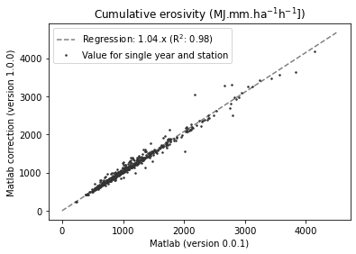
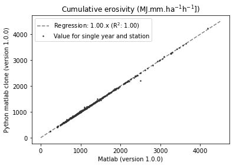

.. _codelegacy:

Code legacy
===========

The first version of the R-factor scripts was developed by
`KU Leuven <https://www.kuleuven.be/english/>`_ (Laboratory for Experimental
Geomorphology, Department of Geography-Geology) in 2001. In 2019, the Matlab
script were adopted by VPO, VMM and Fluves. During 2019, a number of bugs were
fixed in the Matlab script without using code versioning (see Gobeyn et al.,
2021, in Dutch). Since 2021, code versioning via git is applied (i.e. version
0.0.1). The Matlab scripts were evaluated and translated to Python in order to
optimize performance, code readability and user-friendliness. During this
evaluation phase a number of additional bugs were identified and
corrected. In the following section a brief comparison is presented between the Matlab
(version 0.0.1) and Python implementation.

For the code comparison, both the Matlab code and the reimplementation in
Python are run with rainfall input data from Belgium (KMI and VMM).
In the figure below, a comparison is shown between
the Matlab code available in version 0.0.1, on the one hand, and the Python version on
the other. For this figure, the cumulative erosivity at the end of the year
was compared for all years of all stations individually. Differences are
explained by a  if/else-case defined in the Matlab version 0.0.1 in which
the maximum 30-minute intensity was mistakenly multiplied by two. In addition,
incorrect indices for the first rainfall record were used in the computation of
the maximum 30-minute rainfall intensity.

In the next figure, the comparison is made between the corrected Matlab version
(1.0.0) and the Python reimplementation. Here the minor deviations are
related to decimal precision.

Currently, the Python implementation is adopted for future developments and
applications and unit tests included to guarantee the future consistency.

References
----------
Gobeyn, S., Van de Wauw, J., De Vleeschouwer, N., Renders, D., Van Ransbeeck,
N., Verstraeten, G., Deproost, P., 2021. Herziening van de
neerslagerosiviteitsfactor R voor de Vlaamse erosiemodellering.
Departement Omgeving, Brussel.
